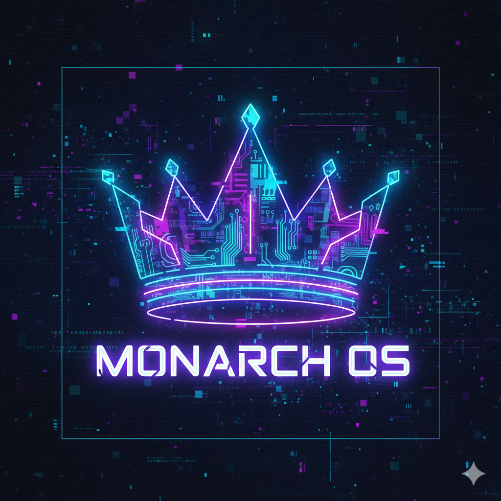

# Monarch

Monarch is based on [Omarchy](https://omarchy.org) which is a great way to get a fresh Arch installation into a fully-configured, beautiful, and modern web development system. Monarch diverges from upstream on one important point: **it ships [Niri](https://github.com/YaLTeR/niri) (scrollable-tiling Wayland compositor) instead of Hyprland**, for better stability.

Monarch aims to provide a cybersecurity platform inspired by [SkillArch](https://github.com/laluka/SkillArch) with tools and aliases preinstalled.

## License

Monarch is released under the [MIT License](https://opensource.org/licenses/MIT).
